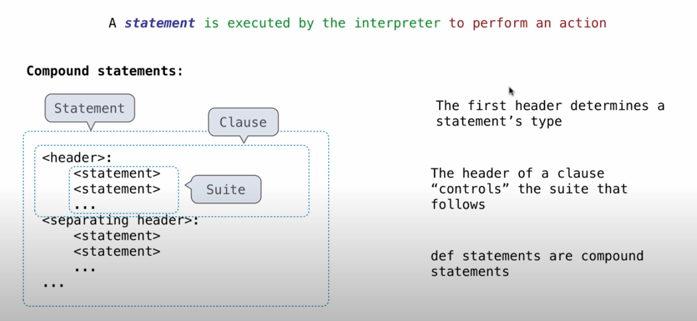

# Chapter 1

## 1.2 Elements of Programing

### 1.2.4 Names and the Enviroment

> Assignment is our simplest means of abstraction, for it allows us to use simple names to refer to the results of compound operations, such as the area computed above. In this way, complex programs are constructed by building, step by step, computational objects of increasing complexity.

> The possibility of binding names to values and later retrieving those values by name means that the interpreter must maintain some sort of memory that keeps track of the names, values, and bindings. This memory is called an environment.

> When executing an assignment statement, Python evaluates the expression to the right of = before changing the binding to the name on the left. Therefore, one can refer to a name in right-side expression, even if it is the name to be bound by the assignment statement.

- an enviroment is a sequence of frames.
  - the global frame alone
  - A local, then the global frame
- Every expression is evaluated in the context of an environment
  - A name evaluates to the value bound to that name in the earliest frame of the current environment in which that name is found
  - I think it likes the js exec context

```py
# so the expression like:
x = y = z = 1
# is valid in python, because python will evaluate the right expression before changing the bind of left
# and the assignment is just a operation that changing bind.
>>> x = y = z = 1
>>> x, y, z = 1, 2, 3
>>> x, y, z
(1, 2, 3)
```

> Apply the function that is the value of the operator subexpression to the arguments that are the values of the operand subexpressions.

### 1.2.6 The Non-Pure Print Function

> Pure functions. Functions have some input (their arguments) and return some output (the result of applying them). Pure functions have the property that applying them has no effects beyond returning a value. Moreover, a pure function must always return the same value when called twice with the same arguments.

> Non-pure functions. In addition to returning a value, applying a non-pure function can generate side effects, which make some change to the state of the interpreter or computer.

a side effect isn't a value; it's anything that happens as a consequence of calling a function

so Non-pure functions can not be used effectivefly in nested expressions.

> In computer science, an operation, function or expression is said to have a side effect if it modifies some state variable value(s) outside its local environment, which is to say if it has any observable effect other than its primary effect of returning a value to the invoker of the operation.

## Defining New Functions

> Now we will learn about function definitions, a much more powerful abstraction technique by which a name can be bound to compound operation, which can then be referred to as a unit.

> An import statement binds a name to a built-in function. A def statement binds a name to a user-defined function created by the definition.

> The name appearing in the function is called the intrinsic name. The name in a frame is a bound name. There is a difference between the two: different names may refer to the same function, but that function itself has only one intrinsic name.



```py
# if a function is not defined in another function, it counldn't get its parent enviroment value
>>> def bottom():
...     c = 1
...     return b + c + a
...
>>> def top():
...     b = 2
...     return bottom()
...
>>> a = 10
>>> top()
Traceback (most recent call last):
  File "<stdin>", line 1, in <module>
  File "<stdin>", line 3, in top
  File "<stdin>", line 3, in bottom
NameError: name 'b' is not defined
```

> 1. Function names are lowercase, with words separated by underscores. Descriptive names are encouraged.
> 2. Function names typically evoke operations applied to arguments by the interpreter (e.g., print, add, square) or the name of the quantity that results (e.g., max, abs, sum).
> 3. Parameter names are lowercase, with words separated by underscores. Single-word names are preferred.
> 4. Parameter names should evoke the role of the parameter in the function, not just the kind of argument that is allowed.
> 5. Single letter parameter names are acceptable when their role is obvious, but avoid "l" (lowercase ell), "O" (capital oh), or "I" (capital i) to avoid confusion with numerals.

> In other words, a function definition should be able to suppress details. The users of the function may not have written the function themselves, but may have obtained it from another programmer as a "black box". A programmer should not need to know how the function is implemented in order to use it. The Python Library has this property. Many developers use the functions defined there, but few ever inspect their implementation.

> Aspects of a functional abstraction. To master the use of a functional abstraction, it is often useful to consider its three core attributes. _**The domain of a function is the set of arguments it can take. The range of a function is the set of values it can return. The intent of a function is the relationship it computes between inputs and output (as well as any side effects it might generate).**_ Understanding functional abstractions via their domain, range, and intent is critical to using them correctly in a complex program.

### 1.4 Designing Functions

- Each function should have exactly one job
- Don't repeat yourself is a central tenet of software engineering
- Functions should be defined generally.

> code is written only once, but often read many times.

> To execute a sequence of statements, execute the first statement. If that statement does not redirect control, then proceed to execute the rest of the sequence of statements, if any remain.

> The fact that functions can only manipulate their local environment is critical to creating modular programs

> The key to effective testing is to write (and run) tests immediately after implementing new functions. It is even good practice to write some tests before you implement, in order to have some example inputs and outputs in your mind. A test that applies a single function is called a unit test. Exhaustive unit testing is a hallmark of good program design.

## 1.6 Higher-Order Functions

> Functions that manipulate functions are called higher-order functions. This section shows how higher-order functions can serve as powerful abstraction mechanisms, vastly increasing the expressive power of our language.

> Lexical scope. Locally defined functions also have access to the name bindings in the scope in which they are defined. In this example, sqrt_update refers to the name a, which is a formal parameter of its enclosing function sqrt. This discipline of sharing names among nested definitions is called lexical scoping. Critically, the inner functions have access to the names in the environment where they are defined (not where they are called).

```
1. Each user-defined function has a parent environment: the environment in which it was defined.
2. When a user-defined function is called, its local frame extends its parent environment.
```

when a nested function was called, it means its parent already been called

> The names of a local function do not interfere with names external to the function in which it is defined, because the local function name will be bound in the current local environment in which it was defined, rather than the global environment.
> A local function can access the environment of the enclosing function, because the body of the local function is evaluated in an environment that extends the evaluation environment in which it was defined.

> We can use higher-order functions to convert a function that takes multiple arguments into a chain of functions that each take a single argument. More specifically, given a function f(x, y), we can define a function g such that g(x)(y) is equivalent to f(x, y). Here, g is a higher-order function that takes in a single argument x and returns another function that takes in a single argument y. This transformation is called currying.

### 1.6.6 currying

```py
def map_to_range(start, end, f):
    while start < end:
        print(f(start))
        start = start + 1

# currying
def curry2(f):
    def h(x):
        def g(y):
            return f(x, y)

        return g

    return h


def curryTest(x, y):
    print(x, y)

currying = curry2(curryTest)
currying(1)(2)
```

### 1.6.7 lambda expression

```py
>>> s = lambda x: x * x
>>> s
<function <lambda> at 0xf3f490>
>>> s(12)
144
```

### 1.6.8 first-class functions
~~~~
They may be bound to names.
They may be passed as arguments to functions.
They may be returned as the results of functions.
They may be included in data structures.
~~~~


### 1.6.9 function decorator

```py
def trace(fn):
    def wrapper(x):
        print(fn, '(', x, ')')
        return fn(x)
    
    return wrapper

@trace    
def square(x):
    return x * x

result = square(12)
print(result)
```
>In this example, A higher-order function trace is defined, which returns a function that precedes a call to its argument with a print statement that outputs the argument. The def statement for triple has an annotation, @trace, which affects the execution rule for def. As usual, the function triple is created. However, the name triple is not bound to this function. Instead, the name triple is bound to the returned function value of calling trace on the newly defined triple function.